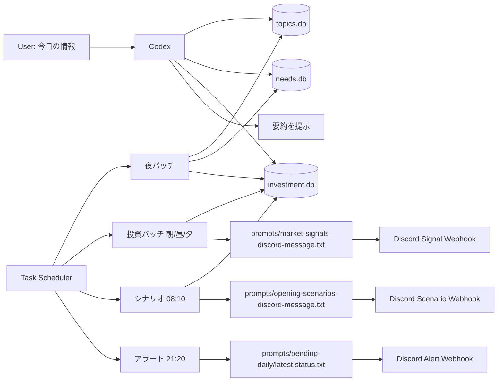
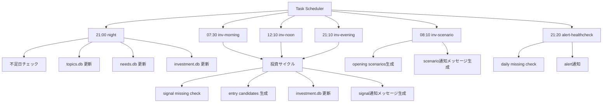
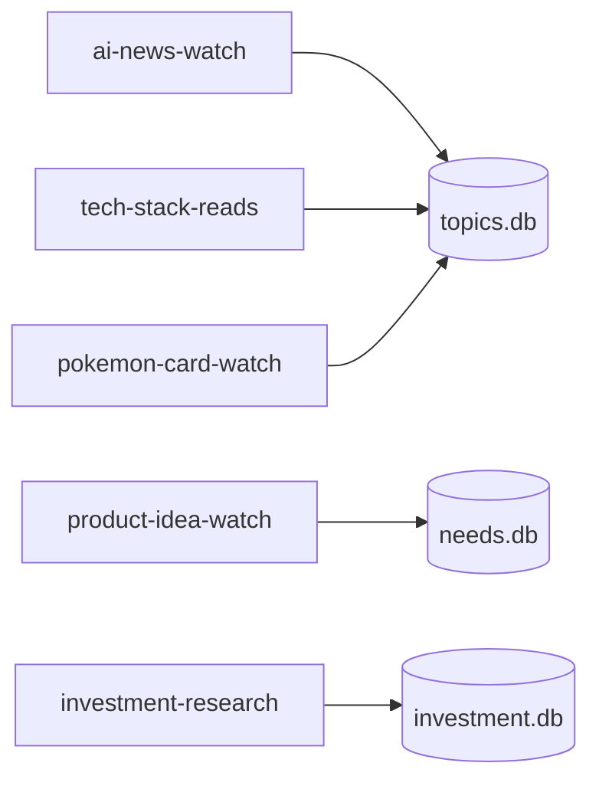
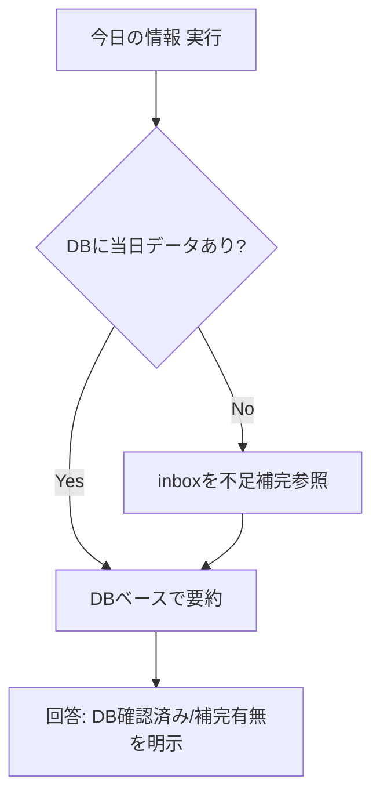

# Ops Flow Overview

以下は、現行運用（全topic）の実行フローを「読む目的別」に分解したものです。

## 1) 全体像（30秒版）

```mermaid
flowchart LR
    TS[Task Scheduler] --> NIGHT[夜バッチ]
    TS --> INV[投資バッチ 朝/昼/夕]
    TS --> SCN[シナリオ 08:10]
    TS --> ALT[アラート 21:20]
    NIGHT --> TOPDB[(topics.db)]
    NIGHT --> NEEDDB[(needs.db)]
    NIGHT --> INVDB[(investment.db)]
    INV --> INVDB
    SCN --> INVDB
    USER[User: 今日の情報] --> CODEX[Codex]
    CODEX --> TOPDB
    CODEX --> NEEDDB
    CODEX --> INVDB
    CODEX --> OUT[要約を提示]
    INV --> SIGMSG[prompts/market-signals-discord-message.txt]
    SCN --> SCNMSG[prompts/opening-scenarios-discord-message.txt]
    ALT --> ALMSG[prompts/pending-daily/latest.status.txt]
    SIGMSG --> D1[Discord Signal Webhook]
    SCNMSG --> D2[Discord Scenario Webhook]
    ALMSG --> D3[Discord Alert Webhook]
```

## 2) 定期実行フロー

```mermaid
flowchart TD
    TS[Task Scheduler] --> N[21:00 night]
    TS --> M[07:30 inv-morning]
    TS --> S[08:10 inv-scenario]
    TS --> D[12:10 inv-noon]
    TS --> E[21:10 inv-evening]
    TS --> A[21:20 alert-healthcheck]

    N --> N1[不足日チェック]
    N --> N2[topics.db 更新]
    N --> N3[needs.db 更新]
    N --> N4[investment.db 更新]

    M --> I[投資サイクル]
    D --> I
    E --> I
    I --> I1[signal missing check]
    I --> I2[entry candidates 生成]
    I --> I3[investment.db 更新]
    I --> I4[signal通知メッセージ生成]
    S --> S1[opening scenarios生成]
    S --> S2[scenario通知メッセージ生成]
    A --> A1[daily missing check]
    A --> A2[alert通知]
```

## 3) DB分離方針

```mermaid
flowchart LR
    A[ai-news-watch] --> TDB[(topics.db)]
    B[tech-stack-reads] --> TDB
    C[pokemon-card-watch] --> TDB
    D[product-idea-watch] --> NDB[(needs.db)]
    E[investment-research] --> IDB[(investment.db)]
```

## 4) 「今日の情報」参照順

```mermaid
flowchart TD
    S[今日の情報 実行] --> DB{DBに当日データあり?}
    DB -->|Yes| SUM[DBベースで要約]
    DB -->|No| FB[inboxを不足補完参照]
    FB --> SUM
    SUM --> REP[回答: DB確認済み/補完有無を明示]
```
