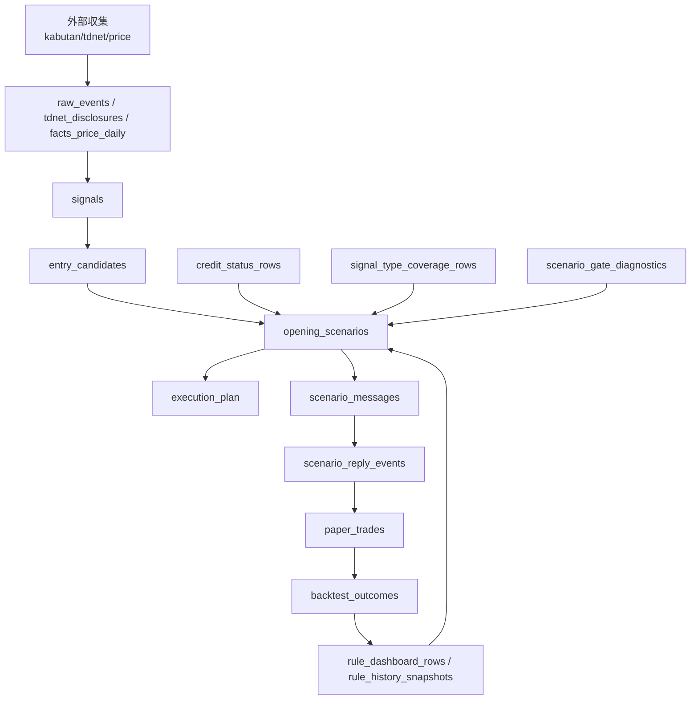

# investment.db テーブル用途棚卸し（2026-05-22）

## 目的
- 収集/分析/通知フローで各テーブルが何に使われているかを明確化する。
- 未稼働テーブルと削除候補を分離し、運用影響を可視化する。

## 判定基準
- 参照本数: `scripts/*.py` 内でテーブル名が出現するファイル本数（機械抽出）。
- 行数: `data/investment.db` 現在値。
- 区分:
  - 運用中: 行数>0 かつ主要バッチ/通知で利用。
  - 補助: 行数>0 だが監査/診断/レポート寄り。
  - 未稼働: 行数=0（ただし将来機能の予約を含む）。

## コア運用テーブル（運用中）
- `facts_price_daily` (1,594,055): 日足価格本体。シグナル/結果判定の基礎。
- `signals` (1,170): シグナル正規化本体。
- `backtest_outcomes` (1,062): T+1/T+5/T+20 成績母集団。
- `entry_candidates` (38): 日次候補。
- `opening_scenarios` (10): 通知するシナリオ本体。
- `execution_plan` (60): rank/ev/rr を含む実行案。
- `paper_trades` (788): entry/exit/評価の実績。
- `scenario_messages` (17): Discord投稿IDトラッキング。
- `scenario_reply_events` (10): 返信コマンド反映履歴。
- `tdnet_disclosures` (3,866): 材料イベント母集団。
- `credit_status_rows` (1,932): 信用可否（manual/auto_sbi）統合。
- `instruments` (2,005): 銘柄マスタ（銘柄名補完にも利用）。

## 収集運用テーブル（運用中）
- `collection_progress` (1,864): 収集進捗。
- `collection_artifacts` (50): 収集KPI/計画系の成果物。
- `raw_events` (2,261): 生イベント監査。
- `ingest_log` (1,854): 取込実行ログ。
- `daily_digest` (21): 汎用トピック日次要約。
- `observations` (14): 手動観測メモ。

## 分析/診断テーブル（補助）
- `rule_dashboard_rows` (154): ルール集計。
- `rule_history_snapshots` (174): ルール時系列。
- `rule_check_candidates` (72): ルール候補検証。
- `scenario_gate_diagnostics` (6): gate reject理由の可視化。
- `signal_type_coverage_rows` (92): 種別母数カバレッジ。
- `short_readiness_rows` (6): ショート準備度。
- `short_chart_reviews` (6): チャート追認。
- `short_rebound_reviews` (6): 反発除外判定。
- `short_conviction_rows` (6): 確信度判定。

## 未稼働テーブル（行数0）
- `board_snapshots` (0)
- `margin_context_rows` (0)
- `market_context_rows` (0)
- `sector_context_rows` (0)
- `sector_market_context_rows` (0)
- `technical_context_rows` (0)

## 解釈（現時点）
- 未稼働6テーブルは「将来拡張スキーマ」で、現行の通知/売買候補の必須経路には未接続。
- ただしコード参照は残っているため、即DROPより先に「接続するか削除するか」の方針決定が必要。

## 次アクション提案
1. 未稼働6テーブルを `active` / `defer` / `drop` の3分類で決定する。
2. `defer` は作成だけ残し、書き込みジョブを止める（または未実装明記）。
3. `drop` は `init_investment_db.py` から定義除去し、移行SQLを作成する。
## 未稼働6テーブルの分類（2026-05-22時点）
- `defer-active`（DROPしない）
  - `board_snapshots`: `build_opening_scenarios.py` で寄り前板情報として参照。
  - `sector_context_rows`: シナリオ/シグナル通知で sector 補足に参照。
  - `technical_context_rows`: `fill_technical_context.py` が書き込み、分析JOIN先として使用。
  - `market_context_rows`: 分析JOIN先として使用。
  - `sector_market_context_rows`: 分析JOIN先として使用。
  - `margin_context_rows`: 分析JOIN先・unknown優先度抽出で使用。

- 理由
  - 6テーブルともコード参照があり、スキーマ除去するとSQLエラー化リスクがある。
  - 現在0件なのは「投入ジョブ未実行/データ未取得」の問題で、テーブル自体が不要という根拠は現時点で不足。

- 実行経路（スケジューラー接続）
  - `AIOS-Inv-*` タスク -> `scripts/ops/run_inv_*_and_post.ps1` -> `scripts/run_ops_scheduler.py --slot ...`
  - `inv-scenario` では `collect_credit_status_auto` -> `build_opening_scenarios` -> `build_execution_plan` -> `post_scenarios_bot` まで連結。

- 次アクション
  1. 0件のまま継続する3日を閾値にし、投入ジョブの実行ログ確認を自動化。
  2. `fill_*_context` 系の夜間スロット実行結果を `ingest_log` と突合する監視を追加。
  3. 参照だけで実利用がないと判明したものから、段階的に `drop候補` へ移す。
## 条件依存テーブル（0件でも正常になり得る挙動）

以下は、運用が進むと入る可能性がある一方、上流入力がない日は0件でも異常とは限らない。

- `board_snapshots`
  - 役割: 寄り前の板気配（best_bid/best_ask/indicative_open）の補助情報。
  - 投入条件: `data/rakuten_rss/board_latest.csv` が存在し、`load_rakuten_board_snapshot.py` を実行した日。
  - 0件になる主因: CSV未生成、またはロードジョブ未実行。

- `margin_context_rows`
  - 役割: 信用残・逆日歩系の手動補完コンテキスト。
  - 投入条件: 手動入力mdが存在し、`extract_margin_context.py` 実行。
  - 0件になる主因: 手動入力未作成、または取り込み未実行。

- `market_context_rows`
  - 役割: 反応日の地合い（日経/TOPIX/米指数/為替）を粗分類。
  - 投入条件: outcomes入力があり `fill_market_context.py` が走ること。
  - 0件になる主因: outcomes未生成、キャッシュ/取得不足。

- `sector_context_rows`
  - 役割: 銘柄のセクター/地合い感応度の粗分類。
  - 投入条件: outcomes入力があり `fill_sector_context.py` が走ること。
  - 0件になる主因: outcomes未生成。

- `sector_market_context_rows`
  - 役割: セクタープロキシETFの反応日変動でセクター追い風/逆風を粗分類。
  - 投入条件: outcomes入力 + `fill_sector_market_context.py` 実行。
  - 0件になる主因: outcomes未生成、プロキシ取得不足。

- `technical_context_rows`
  - 役割: MA/RSI/MACD/BB等の日足テクニカル文脈を保存。
  - 投入条件: outcomes入力が存在し、`fill_technical_context.py` がskipされないこと。
  - 0件になる主因: outcomesファイル未存在でスクリプトが早期skip。

補足:
- これらは「条件依存コンテキスト層」であり、コア運用（signals/opening_scenarios/execution_plan等）とは独立して不足しうる。
- 0件継続を異常判定する場合は、実行ログ（タスク実行の有無）と上流入力有無を同時に確認すること。
## スロット別テーブル更新マップ（2026-05-22時点）

前提:
- 実行起点は Task Scheduler -> `scripts/ops/run_*_and_post.ps1` -> `scripts/run_ops_scheduler.py --slot ...`
- `ingest_investment_db.py` は inbox/analysis成果物をDBへ反映する集約ポイント。

### 1) night
主な実行:
- 汎用トピック収集/取込
- 投資シグナル収集（kabutan）
- signal/candidate再生成
- rule再現性系更新
- technical_context補完（best effort）

主に更新されるテーブル:
- 収集系: `raw_events`, `tdnet_disclosures`, `signals`, `entry_candidates`, `collection_progress`, `collection_artifacts`, `ingest_log`
- 分析系: `backtest_outcomes`, `rule_dashboard_rows`, `rule_history_snapshots`, `rule_check_candidates`, `short_readiness_rows`, `short_chart_reviews`, `short_rebound_reviews`, `short_conviction_rows`, `technical_context_rows`
- トピック系: `daily_digest`（topics DB側取込含む）

### 2) inv-morning
主な実行:
- tdnet/kabutan更新
- signal/candidate再生成
- 品質チェック

主に更新されるテーブル:
- `tdnet_disclosures`, `signals`, `entry_candidates`, `raw_events`, `ingest_log`
- （条件次第）`collection_progress`

### 3) inv-noon
主な実行:
- tdnet更新
- signal再評価（reevaluate）
- candidate再生成
- シナリオ返信同期（Discord返信反映）

主に更新されるテーブル:
- `tdnet_disclosures`, `signals`, `entry_candidates`, `ingest_log`
- `scenario_reply_events`（返信コマンド取り込み時）
- `paper_trades`（entry/exit/cancel反映があった場合）

### 4) inv-evening
主な実行:
- tdnet/kabutan更新
- outcomes補完
- signal再評価
- technical context補完
- rule再現性更新
- watch->trade分析素材更新

主に更新されるテーブル:
- 収集/基礎: `tdnet_disclosures`, `signals`, `entry_candidates`, `ingest_log`
- 分析: `backtest_outcomes`, `technical_context_rows`, `rule_dashboard_rows`, `rule_history_snapshots`, `rule_check_candidates`, `short_*`
- 実績: `paper_trades`（watch outcome補完の反映）

### 5) inv-scenario
主な実行:
- 信用可否自動収集
- opening scenario生成
- execution plan生成/指標補完
- watch paper登録
- シナリオ通知/投稿

主に更新されるテーブル:
- `credit_status_rows`
- `opening_scenarios`
- `scenario_gate_diagnostics`
- `execution_plan`
- `paper_trades`（watchモード登録）
- `scenario_messages`（Bot投稿時）

### 補足（条件依存で更新）
- `board_snapshots`: `load_rakuten_board_snapshot.py` 実行時のみ
- `margin_context_rows`: `extract_margin_context.py` 実行時のみ
- `market_context_rows`: `fill_market_context.py` 実行時のみ
- `sector_context_rows`: `fill_sector_context.py` 実行時のみ
- `sector_market_context_rows`: `fill_sector_market_context.py` 実行時のみ

これらは現行スロット標準経路に常時は入っておらず、0件でも設計上ありうる。

## シナリオ増加の設計（KPI付き）

### 目的
- `opening_scenarios` の安定供給（量）と品質維持（質）を両立する。

### 先行KPI（上流）
1. 収集量KPI（毎日）
- `tdnet_disclosures` 当日取込件数
- `raw_events` 当日取込件数
- 目安: 直近5営業日移動平均を下回る日が2日連続したら要調査

2. 正規化KPI（毎日）
- `signals` 当日件数
- `signals / tdnet_disclosures` 変換率
- 目安: 変換率の急落（前週比 -20%以上）で分類辞書見直し

3. 母数KPI（週次）
- `signal_type_coverage_rows` の shortage件数
- 目安: shortage=0維持（material対象）

### 中流KPI（候補化）
1. 候補化率
- `entry_candidates / signals`
- 目安: 直近週平均から -15%以上悪化でゲート分解確認

2. ゲート却下内訳
- `scenario_gate_diagnostics` reject reason別件数
- 目安: 単一理由が50%以上を占有したら調整候補

3. 信用可否充足
- `credit_status_rows` における `credit_status=unknown` 比率
- 目安: short候補ティッカーで unknown率を週次で逓減

### 下流KPI（シナリオ/実績）
1. 供給量
- `opening_scenarios` の日次件数（trade/watch別）
- 目安: watch偏重が続く場合、reject理由と勝率母数不足を優先解消

2. 実績接続
- `paper_trades` 登録件数
- `backtest_outcomes` 追加件数
- 目安: `勝率目安データ不足` 表示率を週次で低下

### 実行ループ
1. 上流不足を解消（収集/分類）
2. 中流の詰まりを解消（reject理由ごと）
3. 下流実績を補完（watch/trade結果蓄積）
4. 週次で閾値再評価（次週反映）

## 収集強化タスク（合意版 / 2026-05-22）

### フェーズ1: 計測追加（先行実施）
1. 漏斗KPI日次出力を追加
- 指標: `tdnet_disclosures/raw_events -> signals -> entry_candidates -> opening_scenarios`
- 成果物: 日次レポート（DB集計）
- 完了条件: 各スロット実行後に当日値が確認できる

2. 変換率監視
- 指標: `signals / tdnet_disclosures`
- アラート条件: 前週平均比 -20%
- 完了条件: 条件一致時にアラート本文へ理由付き出力

3. 欠損監視
- 指標: `facts_price_daily` 当日対象銘柄の欠損率
- 閾値: 1%
- 完了条件: 閾値超過時に再収集タスクを1回だけ提案/実行

### フェーズ2: 収集強度引き上げ（段階適用）
1. 材料収集強度
- `discover-latest` / `max-pages` を +25%（1週観察）
- 問題なければ +50%

2. outcomes補完幅
- `fill_market_outcomes` の対象幅を段階拡張
- `signal_type_coverage_rows` shortage=0 を維持

3. 信用可否収集
- `collect_credit_status_auto.py --max-tickers` を 30 -> 50
- short候補優先順でunknown削減

### フェーズ3: 週次チューニング
1. 毎週レビュー
- `scenario_gate_diagnostics` の reject理由占有率
- `n<2` 表示比率
- watch/trade比率

2. 閾値再評価
- ノイズ増なら pages/tickers を段階戻し
- 品質維持できる範囲で母数優先

### 運用メモ
- 今週は「計測追加」を先に完了させる。
- 来週に「強度引き上げ」を実施する。
- 週末に「閾値見直し」を固定ルーチン化する。

### フェーズ2 適用状況（2026-05-22）
- kabutan収集強度を第1段で引き上げ（+25%相当）。
  - KABUTAN_DISCOVER_LATEST: 28 -> 35
  - KABUTAN_MAX_PAGES_NIGHT: 40 -> 50
  - KABUTAN_MAX_PAGES_MORNING: 36 -> 45
  - KABUTAN_MAX_PAGES_EVENING: 28 -> 35
- 信用可否収集の対象上限を拡張。
  - inv-scenario collect_credit_status_auto --max-tickers: 30 -> 50
- 方針: 1週間観察後、ノイズ/品質低下がなければ次段調整（維持または追加拡張）を判断する。

### フェーズ3 実装状況（2026-05-22）
- 週次チューニングレビューを自動化: scripts/investment/analysis/report_weekly_tuning_review.py
- 指標: watch/trade比率、低母数表示比率、gate reject理由偏在、credit unknown比率
- 出力: collection_artifacts(artifact_key=weekly_tuning_review) と inbox md
- 接続: run_ops_scheduler.py の night スロットで日次更新（直近7日窓）

### フェーズ3 追加（3営業日暫定判定の自動化）
- 追加: scripts/investment/analysis/decide_collection_intensity.py
- 入力: collection_artifacts の signal_pipeline_kpi / weekly_tuning_review
- 判定: maintain / intensify / rollback（3日窓）
- 保存: collection_artifacts(artifact_key=collection_intensity_decision)
- 接続: run_ops_scheduler.py night で日次実行（--window-days 3）
- 注意: 営業日外は当日price欠損率が高く出るため rollback 判定が出やすい。運用上は営業日判定と併用する。

### 追加懸念タスク（運用監視フェーズ）
1. 営業日判定の厳密化
- 現状は weekday 判定のみ。祝日を考慮したJP営業日カレンダー連携を追加する。
- 影響: 非営業日の誤判定（maintain/rollback）をさらに減らす。

2. 3日判定の自動アクション連携
- `collection_intensity_decision` が `intensify/rollback` の時、設定差分を提案するだけでなく実行候補を自動生成する。
- 影響: 手動オペ判断の遅延を減らす。

3. weekly失敗箇所の可視化
- `AIOS-Backtest-Weekly` で失敗したサブコマンド名をログに明示出力。
- 影響: 復旧時間短縮。

4. KPI通知の最小サマリ化
- `signal_pipeline_kpi` / `weekly_tuning_review` / `collection_intensity_decision` の重要値だけを1メッセージ化（過多通知回避）。
- 影響: 監視負荷低減。

5. signal変換率の種別別監視
- `signals/tdnet` を全体だけでなく signal_type 別に監視し、辞書漏れを早期検知。
- 影響: 母数不足の原因特定を高速化。

### 追加懸念1-5 実装（2026-05-23）
- [1] 営業日判定厳密化: decide_collection_intensity.py で jpholiday 判定を導入（未導入時はweekday fallback）。
- [2] 自動アクション連携: collection_intensity_decision に action_plan を保存（強化/維持/ロールバックの推奨差分）。
- [3] weekly失敗可視化: run_backtest_weekly_inner.ps1 で failed_step を例外化し task-scheduler.log 追跡を容易化。
- [4] KPI最小サマリ通知: render_ops_kpi_summary_discord_message.py と post_ops_kpi_discord.ps1 を追加、nightフローに接続。
- [5] 種別別変換率監視: report_signal_pipeline_kpi.py に rates_by_type と type別drop alert を追加。

### MCP/タスクチャンネル連携（2026-05-24）
- Discordタスクチャンネルから運用コマンドを実行する応答Botを追加。
- DB記録: discord_task_events（message_idベースで重複防止）。
- 返信方針: アクション投稿に対してのみ短文返信（pollノイズなし）。
- 既存投資収集ルート（run_ops_scheduler / harvest backfill / outcomes補完）へ接続済み。
